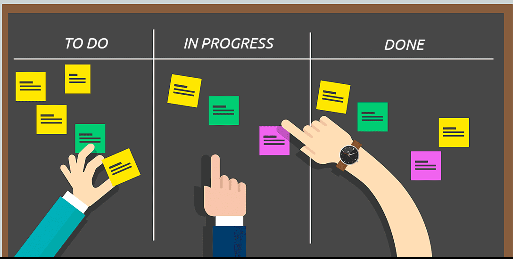

<h1 align="center">
  
</h1>

  

---
## 🚀 techs
- Html
- Css
- Javascript
--- 

### 💻 Sobre o SIMPLE KAMBAN BOARD
Projeto desenvolvido para gerenciamento de TODO, utilizando metodo KamBan para estudos de HTML,CSS e JAVASCRIPT. Acompanhado em master-class de Maik Brito da Rocketseat na missão discover.

### Author
Feito com ❤️ por Rafael Silva